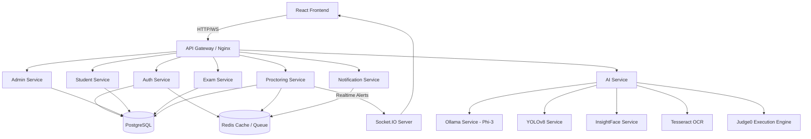
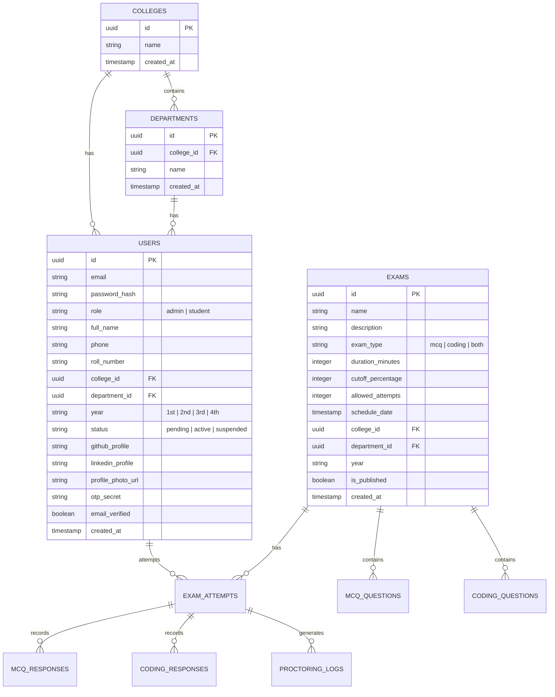
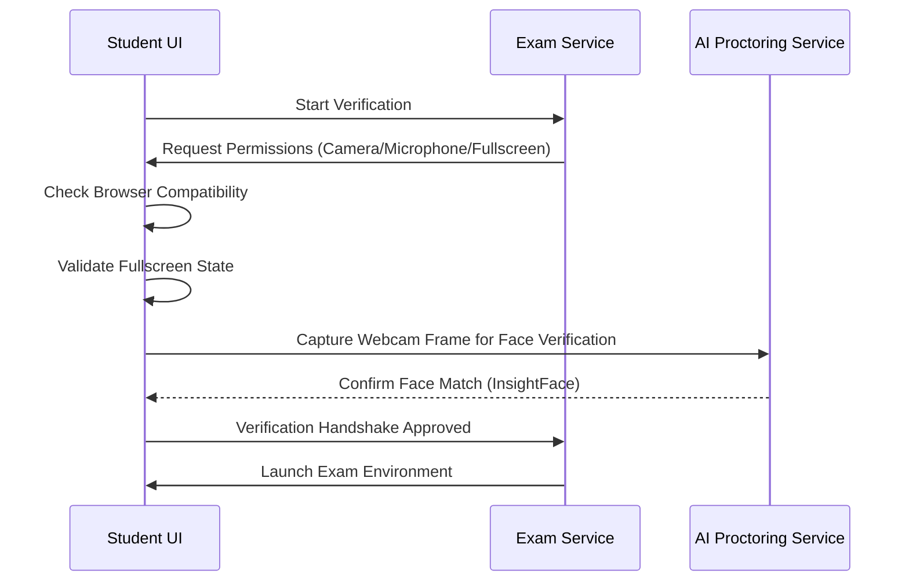

# Clahan Academy V2 Implementation Plan

This document outlines the detailed system architecture, database schema, API contracts, microservices structure, Docker Compose configuration, and user flows for Clahan Academy V2.

## System Architecture

## Service Breakdown

| Service | Port | Description | Tech Stack |
| :--- | :--- | :--- | :--- |
| **frontend-service** | 5173 | UI for Admin and Students | React, Vite, TS, TailwindCSS, ShadCN UI |
| **auth-service** | 4001 | Auth, JWT, OTP, Refresh Tokens | Node.js, Express, TS, PostgreSQL, Redis |
| **admin-service** | 4002 | College, Dept, Student Import, Analytics | Node.js, Express, TS, PostgreSQL |
| **student-service** | 4003 | Profile management, Dashboard | Node.js, Express, TS, PostgreSQL |
| **exam-service** | 4004 | Exam lifecycle, MCQs, Coding, Test execution | Node.js, Express, TS, PostgreSQL, Redis |
| **proctoring-service**| 4005 | Live monitoring, Websockets, Fraud rules | Node.js, Express, TS, Socket.IO, Redis |
| **notification-service**|4006 | Email queue, SMTP worker, templates | Node.js, Express, TS, Redis, Nodemailer |
| **ai-service** | 8000 | Gateway for Ollama, YOLO, OCR, Face | Python, FastAPI, Requests |

---

## Database Schema

---

## Verification & Validation Sequence (Pre-Exam)

---

## Key Technical Decisions
1. **Monorepo Structure**: Keep all code organized in a single repository for easy local building and Docker Compose orchestration.
2. **Robust Email Queueing**: Using Redis as a message queue to prevent SMTP bottlenecks during bulk student imports or result notifications.
3. **Judge0 Integration**: Dockerized local instance of Judge0 for running C++, Java, JS, and Python test cases with CPU/memory constraints.
4. **FastAPI for AI Orchestration**: Acts as a lightweight proxy and preprocesses image files before sending them to specialized YOLOv8 or InsightFace containers.
