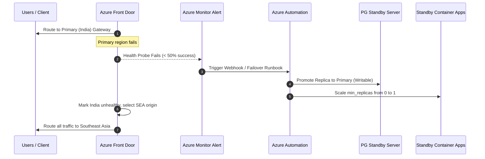

# Clahan-Academy Multi-Region Active-Standby Architecture

This document describes the high-availability infrastructure architecture, private networking design, database replication strategy, and failover/failback mechanisms of the Clahan-Academy Online Exam Platform.

---

## High-Level Architecture Diagram

```
                                +-----------------------------+
                                |      Azure Front Door       |
                                |   (Global Entrypoint WAF)   |
                                +--------------+--------------+
                                               |
                +------------------------------+------------------------------+
                | (Priority 1: Active)                                        | (Priority 2: Standby)
                v                                                             v
      +--------------------+                                        +--------------------+
      |  Application GW    |                                        |  Application GW    |
      |   (WAF Active)     |                                        |   (WAF Standby)    |
      +---------+----------+                                        +---------+----------+
                |                                                             |
                | (VNet Injected)                                             | (VNet Injected)
                v                                                             v
+----------------------------------+                          +----------------------------------+
| VNET: 10.0.0.0/16 (India)        |                          | VNET: 11.0.0.0/16 (SEA DR)       |
|                                  |                          |                                  |
|  [ snet-appgw: 10.0.1.0/24 ]     |                          |  [ snet-appgw: 11.0.1.0/24 ]     |
|              |                   |                          |              |                   |
|  [ snet-containerapp: /23 ]      |                          |  [ snet-containerapp: /23 ]      |
|    - 11 Microservices (Active)   |                          |    - 11 Microservices (Standby)  |
|                                  |                          |                                  |
|  [ snet-data: 10.0.4.0/24 ]      |                          |  [ snet-data: 11.0.4.0/24 ]      |
|    - Key Vault (Private Endpt)   |                          |    - Key Vault (Private Endpt)   |
|    - Service Bus (Private Endpt) |                          |    - Service Bus (Private Endpt) |
|    - Redis Cache (Private Endpt) |                          |    - Redis Cache (Private Endpt) |
|    - PostgreSQL (VNet Delegated) |                          |    - PostgreSQL (VNet Delegated) |
+-----------------^----------------+                          +-----------------^----------------+
                  |                                                             |
                  |                                                             |
                  +==================(Asynchronous Geo-Replication)=============+
```

---

## Key Components

### 1. Global Ingress & Traffic Management
* **Azure Front Door (Standard):** Serves as the global entry point. It has an integrated WAF policy to block malicious payloads at the edge.
* **Health Probes:** Front Door continuously probes the `/` root path of both Application Gateways. If the primary region goes down, probes fail, and traffic is rerouted within seconds.

### 2. Regional Edge Security
* **Application Gateway (WAF_v2):** Deployed per region inside `snet-appgw`.
* **WAF Policy:** Active in both regions, providing layer 7 protection (OWASP Top 10 mitigation).
* **Environment Route:** Directs traffic into the Container App environment default domain.

### 3. Container App Environment (Microservices)
* **Compute:** 11 microservices (8 custom + 3 open-source) are run in a serverless, managed Container App Environment.
* **VNet Integration:** Environments are injected into a `/23` delegated subnet, protecting internal microservice traffic from direct public access.
* **Standby Strategy:** In the secondary region, `min_replicas = 0` is set for all container apps, meaning zero compute is provisioned or billed. When a failover is triggered, they are scaled up to `min_replicas = 1`.

### 4. Data Layer & Replication
* **PostgreSQL Flexible Server:** Deployed with VNet delegation inside `snet-data`.
* **Cross-Region Replication:** The Southeast Asia server is provisioned with `create_mode = "Replica"` pointing to the primary India server. All database updates are asynchronously streamed to the replica.
* **Azure Cache for Redis (Standard C1):** Deployed per region for session caching and transient data. It utilizes a private endpoint, blocking public access.
* **Azure Service Bus (Premium):** Message broker for decoupled, asynchronous notifications and proctoring events. Deployed with private endpoints.

### 5. Security & RBAC
* **Key Vault (Standard):** Stores connection strings and passwords. Access is controlled via Azure RBAC (`Key Vault Secrets User` role assigned to service principal identities).
* **Managed Identities:** Microservices and the Function App use System-Assigned Managed Identities to retrieve secrets from the regional Key Vault, avoiding hardcoded credentials in the container definitions.

---

## Disaster Recovery Failover Architecture



### Failback Strategy
Failing back involves:
1. Backing up the Southeast Asia primary database.
2. Restoring the backup to the India database to synchronize any records written during failover.
3. Setting India back as primary.
4. Setting Southeast Asia back as a replication target.
5. Scaling down the Southeast Asia Container Apps back to `min_replicas = 0`.
